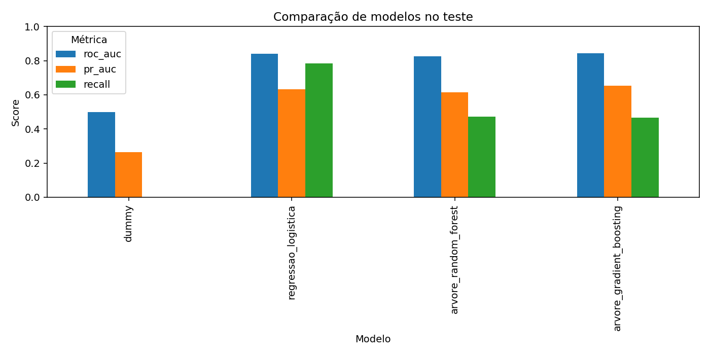
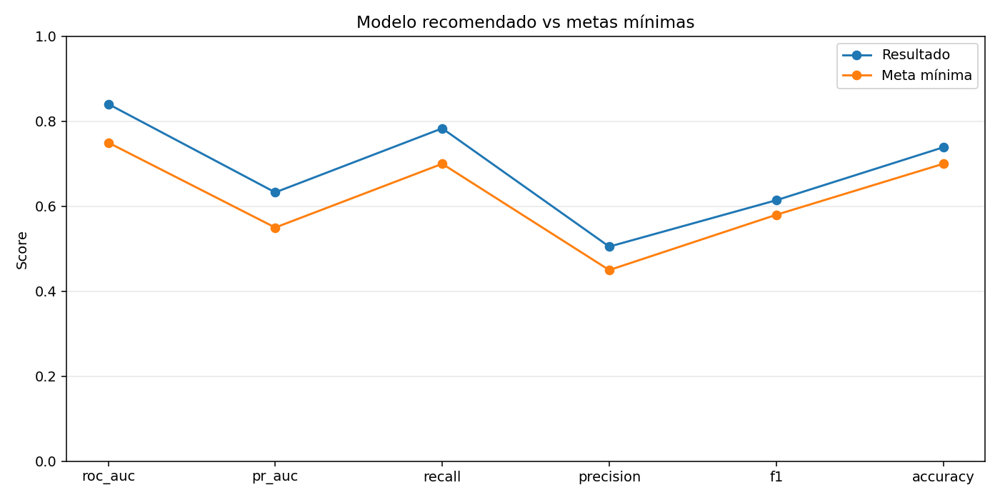

# Relatório Automático do Commit

Data de execução: 2026-03-12 00:38:56 UTC

## Resumo
- Melhor ROC AUC: arvore_gradient_boosting
- Modelo recomendado para retenção: regressao_logistica

## Métricas do baseline (regressão logística)
- roc_auc: 0.8415 (meta 0.75) -> ATINGIU
- pr_auc: 0.6308 (meta 0.55) -> ATINGIU
- recall: 0.7834 (meta 0.70) -> ATINGIU
- precision: 0.5052 (meta 0.45) -> ATINGIU
- f1: 0.6143 (meta 0.58) -> ATINGIU
- accuracy: 0.7388 (meta 0.70) -> ATINGIU

## Métricas do modelo recomendado
- roc_auc: 0.8408 (meta 0.75) -> ATINGIU
- pr_auc: 0.6328 (meta 0.55) -> ATINGIU
- recall: 0.7834 (meta 0.70) -> ATINGIU
- precision: 0.5052 (meta 0.45) -> ATINGIU
- f1: 0.6143 (meta 0.58) -> ATINGIU
- accuracy: 0.7388 (meta 0.70) -> ATINGIU

## Gráficos de apoio

## Recomendações
- Melhorar precision: revisar features e calibrar probabilidade para reduzir falso positivo.

## Próximos passos
- Implementar API FastAPI com /health e /predict + testes de contrato.
- Integrar MLflow para rastrear params, métricas e artefatos de todos os treinos.
- Containerizar treino e API com Dockerfile dedicado para cada fluxo.
- Subir monitoramento no Databricks Free com job diário e alertas de queda de recall.
- Adicionar modelo PyTorch tabular e comparar com as árvores no mesmo protocolo.

## Previsão de conclusão do projeto
- Fase 1 - API e testes: 2 semanas
- Fase 2 - MLflow e monitoramento: 2 semanas
- Fase 3 - Docker e deploy cloud: 2 semanas
- Fase 4 - PyTorch e hardening: 2 semanas
- Previsão total: 8 semanas
