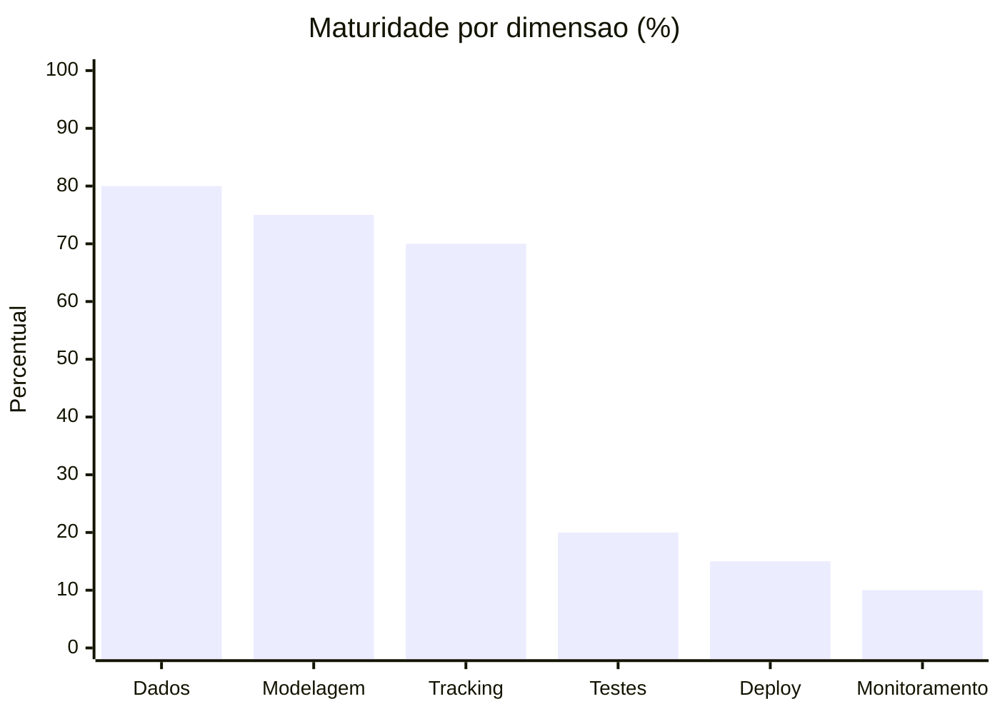

# Relatorio de Status - Fase 1

## 1. Escopo da fase

Atividades-alvo:

1. ML Canvas com stakeholders, metricas de negocio e SLOs
2. EDA completa com volume, qualidade, distribuicao e data readiness
3. Metricas tecnicas (AUC-ROC, PR-AUC, F1) e metrica de negocio
4. Baselines com DummyClassifier e Regressao Logistica
5. Registro de experimentos no MLflow (parametros, metricas e dataset version)

## 2. Progresso das entregas

- [x] ML Canvas documentado
- [x] EDA e readiness documentados com numeros reais
- [x] baseline DummyClassifier implementado
- [x] baseline LogisticRegression implementado
- [x] metricas tecnicas implementadas no pipeline
- [x] metrica de negocio implementada no pipeline
- [x] tracking no MLflow implementado
- [x] hash do dataset logado no MLflow

## 3. Distancia para producao (estimativa)

Leitura:

- dados/modelagem/tracking estao adiantados para Fase 1
- principal gap para producao esta em testes automatizados, deploy e monitoramento

## 4. O que ja esta pronto

- pipeline de treino com split estratificado
- preprocessamento em pipeline sem leakage
- comparacao de modelos com ranking por metricas tecnicas
- metrica financeira para apoiar decisao de campanha
- persistencia do melhor modelo
- rastreabilidade de experimento e dataset no MLflow

## 5. Roadmap para readiness de producao

1. Fase 2 - Engenharia de software
   - aumentar cobertura de testes (unitarios + integracao)
   - padronizar validacao de schema de entrada
2. Fase 3 - Serving
   - implementar API FastAPI (`/predict`, `/health`)
   - empacotar inferencia com versionamento de modelo
3. Fase 4 - Plataforma
   - adicionar Docker e compose para treino/serving
   - configurar CI/CD para treino e publicacao
4. Fase 5 - Operacao
   - monitoramento de performance e drift
   - politicas de re-treino e governanca de rollout

## 6. Indicacao final da Fase 1

A fase atende os requisitos funcionais de baseline e tracking. O projeto ainda nao esta pronto para producao, mas esta pronto para avancar para uma fase de MLOps/serving com base tecnica consistente.
